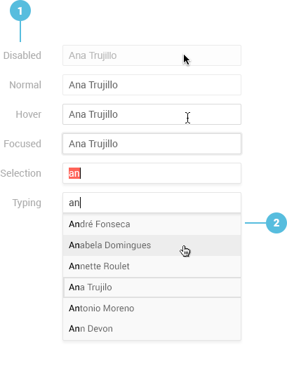

# AutoComplete Overview

The Kendo UI AutoComplete for React provides suggestions to the user from a previously entered list of options depending on the typed input.

The Kendo UI AutoComplete for React is part of the DropDowns `npm` package of the Kendo UI suite for React.

**Figure 1: A template of the Kendo UI AutoComplete for React**



1. AutoComplete interaction states
2. Grouping header
3. Drop-down list item

## Demos

### Default Setup

The example below demonstrates the default setup of a Kendo UI AutoComplete for React.

```html-preview

```
```jsx

```

## Configuration

### Features

The AutoComplete allows you to disable it by setting the [`disabled`](#disabled-booleandefault-false) configuration property to `true`. When disabled, the component is visible, but does not function.

By default, `disabled` is set to `false`.

```html

```
```jsx

```

By configuring the [`minLength`](#minlength-number) property, the AutoComplete allows you to define a minimum number of characters the user should type in the input field before any suggestion is displayed.  

```html

```
```jsx

```

placeholder: PropTypes.string

```html

```
```jsx

```

separator: PropTypes.string

```html

```
```jsx

```

suggest: PropTypes.bool

```html

```
```jsx

```

tabIndex: React.PropTypes.number

```html

```
```jsx

```

### Values

value: PropTypes.string

```html

```
```jsx

```

valueField: PropTypes.string

```html

```
```jsx

```

valueRenderer: PropTypes.func

```html

```
```jsx

```

itemRenderer: PropTypes.func

```html

```
```jsx

```

### State

The AutoComplete is designed as a stateless component. To store its state and configuration properties, wrap it in a high-order component.

The [`onChange`](#onchange-function) event fires each time a user interacts with the AutoComplete. The new value is passed as an argument to the `onChange` callback.

```html

```
```jsx

```

onFilter: PropTypes.func

```html

```
```jsx

```

For detailed information on the Kendo UI AutoComplete for React configuration, refer to its [client-side API documentation]().

## Keyboard Navigation

Below is the list with the keyboard shortcuts the AutoComplete supports.

| SHORTCUT                            | DESCRIPTION         |
|:---                                 |:---                 |

## Accessibility

The AutoComplete is WAI ARIA-accessible through the `Tab` key. The `aria-valuemin`, `aria-valuemax`, and `aria-valuetext` properties define the accessibility values when the user drags the handle of the AutoComplete or interacts with the AutoComplete through its buttons.

## Suggested Links

* [API Reference of the AutoComplete Component]()
