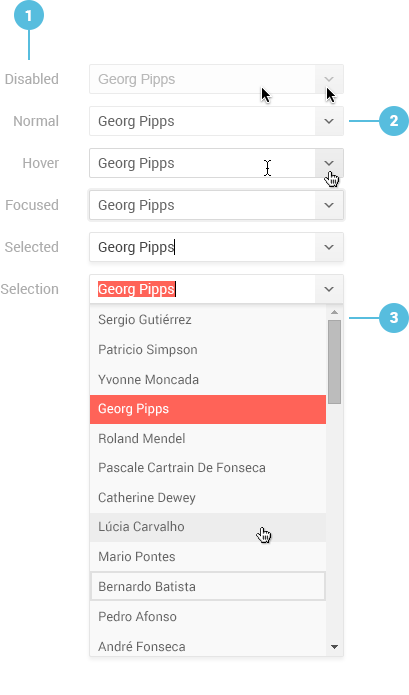

# ComboBox Overview

The Kendo UI ComboBox for React displays a list of pre-defined options. It allows the user to pick a single value from that list, or to enter a custom value through a keyboard input.

The Kendo UI ComboBox for React is part of the DropDowns `npm` package of the Kendo UI suite for React.

**Figure 1: A template of the Kendo UI ComboBox for React**



1. ComboBox interaction states
2. Drop-down **Expand** / **Collapse** button
3. Grouping header
4. Drop-down list item

## Demos

### Default Setup

The example below demonstrates the default setup of a Kendo UI ComboBox for React.

```html-preview

```
```jsx

```

## Configuration

### Features

show: React.PropTypes.bool

```html

```
```jsx

```

The ComboBox allows you to disable it by setting the [`disabled`]() configuration property to `true`. When disabled, the component is visible, but does not function.

By default, `disabled` is set to `false`.

```html

```
```jsx

```

focused: React.PropTypes.number

```html

```
```jsx

```

height: React.PropTypes.oneOfType([
    React.PropTypes.number,
    React.PropTypes.string
])

```html

```
```jsx

```

By configuring the [`minLength`](#minlength-number) property, the ComboBox allows you to define a minimum number of characters the user should type in the input field before any suggestion is displayed.

```html

```
```jsx

```

highlight: React.PropTypes.bool

```html

```
```jsx

```

placeholder: React.PropTypes.string

```html

```
```jsx

```

select: React.PropTypes.func

```html

```
```jsx

```

separator: React.PropTypes.string

```html

```
```jsx

```

suggest: React.PropTypes.bool

```html

```
```jsx

```

tabIndex: React.PropTypes.number

```html

```
```jsx

```

toggle: React.PropTypes.func

```html

```
```jsx

```

### Text

word: React.PropTypes.string

```html

```
```jsx

```

text: React.PropTypes.string

```html

```
```jsx

```

textField: React.PropTypes.string

```html

```
```jsx

```

### Values

value: React.PropTypes.oneOfType([
    React.PropTypes.number,
    React.PropTypes.string
])

```html

```
```jsx

```

valueField: React.PropTypes.string

```html

```
```jsx

```

itemRenderer: React.PropTypes.func

```html

```
```jsx

```

### State

onBlur: React.PropTypes.func

```html

```
```jsx

```

The ComboBox is designed as a stateless component. To store its state and configuration properties, wrap it in a high-order component.

The [`onChange`](#onchange-function) event fires each time a user interacts with the ComboBox. The new value is passed as an argument to the `onChange` callback.

```html

```
```jsx

```

onFilter: React.PropTypes.func

```html

```
```jsx

```

onNavigate: React.PropTypes.func

```html

```
```jsx

```

onTextUpdate: React.PropTypes.func

```html

```
```jsx

```

onToggle: React.PropTypes.func

```html

```
```jsx

```

onSelect: React.PropTypes.func

```html

```
```jsx

```

For detailed information on the Kendo UI ComboBox for React configuration, refer to its [client-side API documentation]().

## Keyboard Navigation

Below is the list with the keyboard shortcuts the ComboBox supports.

| SHORTCUT                            | DESCRIPTION         |
|:---                                 |:---                 |

## Accessibility

The ComboBox is WAI ARIA-accessible through the `Tab` key. The `aria-valuemin`, `aria-valuemax`, and `aria-valuetext` properties define the accessibility values when the user drags the handle of the ComboBox or interacts with the ComboBox through its buttons.

## Suggested Links

* [API Reference of the ComboBox Component]()
